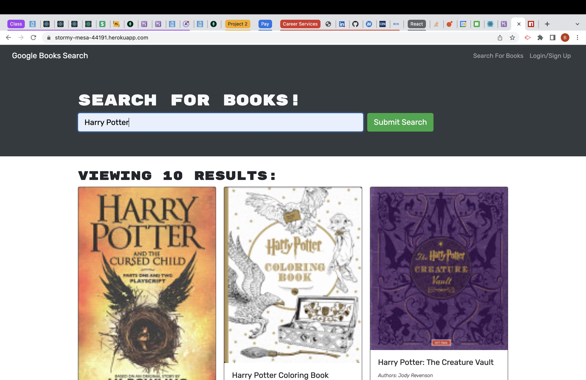

# Welcome to Book Search Engine

#### Book Search Engine is a node/express/mongo back end server with a React front end.  It is set up so that a user can sign up/login and search the Google Books API for books that interest them.

---

#### Collaborators:
*  [Brian Swartz](https://github.com/bdswartz)

---

## Installation
N/A - This app is deployed to Heroku.

---

## Usage

 Please see the application deployed to Heroku at [Book Search Engine](https://stormy-mesa-44191.herokuapp.com/)

---

## Technologies

> <b>Development Tools:</b>
* JavaScript
* [Express.js](https://www.npmjs.com/package/express)
* [MongoDB](https://www.mongodb.com/)
* node.js
* [Mongoose](https://mongoosejs.com/)
* [Apollo GraphQL](https://www.npmjs.com/package/apollo-graphql)
* [JSON Web Tokens](https://www.npmjs.com/package/jsonwebtoken)
* [React Router](https://www.npmjs.com/package/react-router)

  ---

## Features
-  The GraphQL API allows the user to signup as a new user and login at a later date to access their persisting data.
-  A user can search the Google Books API using search terms on the landing page.
-  After logging in the application checks the user's JSON Web Token from local Storage to ensure the user is properly logged into the application and the token is still valid.
-  If logged in the user is able to save books that interest them to their profile.  
-  They can view and manage their saved books on what they see as a separate page (due to the React Router package)

---

## User Story
### AS AN avid reader
I WANT to search for new books to read
SO THAT I can keep a list of books to purchase

### Acceptance Criteria for Minimum Viable Product

GIVEN a book search engine
*  WHEN I load the search engine
    THEN I am presented with a menu with the options Search for Books and Login/Signup and an input field to search for books and a submit button
*  WHEN I click on the Search for Books menu option
    THEN I am presented with an input field to search for books and a submit button
*  WHEN I am not logged in and enter a search term in the input field and click the submit button
    THEN I am presented with several search results, each featuring a book’s title, author, description, image, and a link to that book on the Google Books site
*  WHEN I click on the Login/Signup menu option
    THEN a modal appears on the screen with a toggle between the option to log in or sign up
*  WHEN the toggle is set to Signup
    THEN I am presented with three inputs for a username, an email address, and a password, and a signup button
*  WHEN the toggle is set to Login
    THEN I am presented with two inputs for an email address and a password and login button
*  WHEN I enter a valid email address and create a password and click on the signup button
    THEN my user account is created and I am logged in to the site
*  WHEN I enter my account’s email address and password and click on the login button
    THEN I the modal closes and I am logged in to the site
*  WHEN I am logged in to the site
    THEN the menu options change to Search for Books, an option to see my saved books, and Logout
*  WHEN I am logged in and enter a search term in the input field and click the submit button
    THEN I am presented with several search results, each featuring a book’s title, author, description, image, and a link to that book on the Google Books site and a button to save a book to my account
*  WHEN I click on the Save button on a book
    THEN that book’s information is saved to my account
*  WHEN I click on the option to see my saved books
    THEN I am presented with all of the books I have saved to my account, each featuring the book’s title, author, description, image, and a link to that book on the Google Books site and a button to remove a book from my account
*  WHEN I click on the Remove button on a book
    THEN that book is deleted from my saved books list
*  WHEN I click on the Logout button
    THEN I am logged out of the site and presented with a menu with the options Search for Books and Login/Signup and an input field to search for books and a submit button
---

## Questions
Please visit my GitHub page
at https://github.com/bdswartz

If there are any questions about the project,
feel free to open an issue or contact me at briandswartz@outlook.com